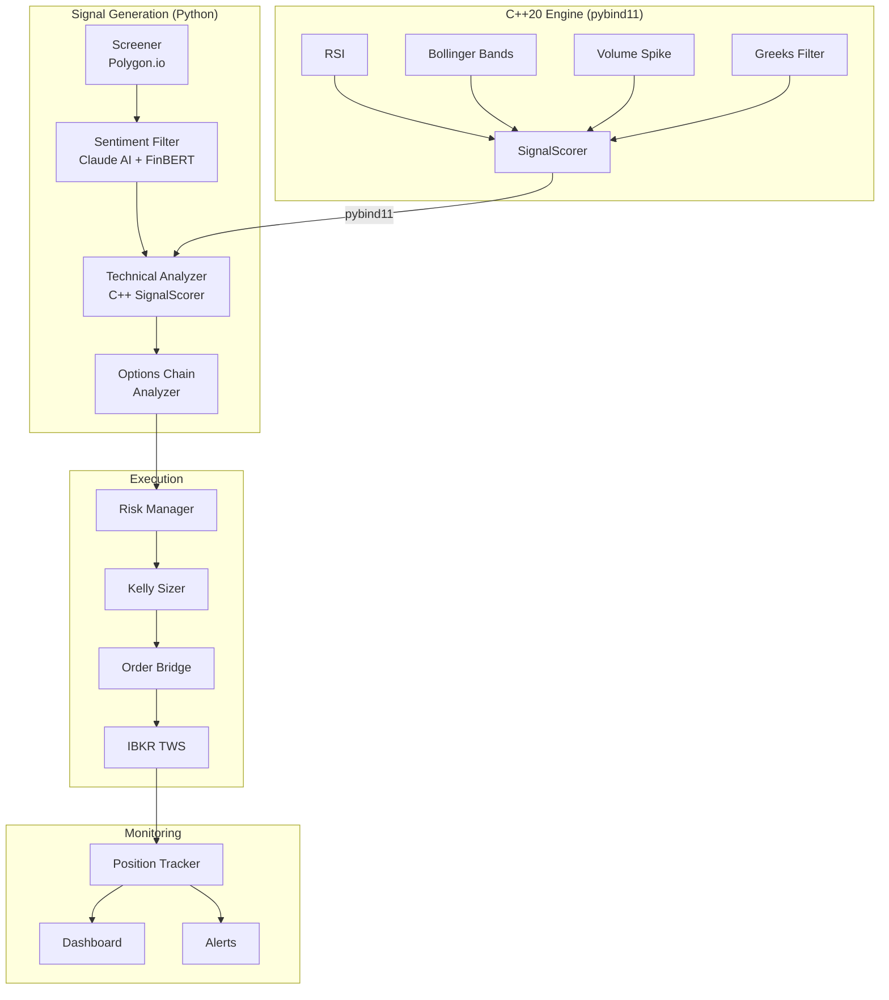

# Contrarian Options Alpha Engine

High-performance C++20/Python options trading engine. Lock-free ring buffer at 29M msg/sec, pybind11 bridge with 16.7x speedup over pure Python, IBKR integration for paper/live trading.

## Architecture



## Backtest Results — SPY Iron Condor (Real Data)

2-year backtest using Goyal-Saretto (2009) HV-IV gap signal with Baltussen et al. (2018) VIX regime filtering:

| Metric | Value |
|--------|-------|
| Period | Mar 2024 – Mar 2026 (2 years) |
| Total return | **+15.7%** ($25K → $28,937) |
| Annualized | ~7.9% |
| Trades | 46 |
| Win rate | **95.7%** (44 wins, 2 losses) |
| Profit factor | 4.14 |
| Sharpe ratio | **2.75** |
| Max drawdown | 2.7% |
| Avg winner | +$122 |
| Avg loser | -$647 |

### Statistical Verification (Harvey-Liu-Zhu 2016)

| Gate | Result | Detail |
|------|--------|--------|
| Sharpe t-stat | **PASS** | 3.86 (statistically significant) |
| Monte Carlo p-value | **PASS** | 0.0000 (not luck) |
| Deflated Sharpe | **PASS** | 1.84 (survives multiple-testing correction) |
| Positive months | **PASS** | 82.6% |
| Trade count | FAIL | 46 trades (need 100+ for full confidence) |
| Subsample stability | FAIL | One subsample had Sharpe 0.08 |

**Verdict: INSUFFICIENT DATA** — the signal looks real (Sharpe 2.75, t-stat 3.86), but 46 trades in 2 years isn't enough for the verification framework to fully approve. Both failures are about sample size, not signal quality. The strategy made money in both QUIET and NORMAL regimes with only 1 stop-loss hit in 2 years. Gap ratio averaged 1.45, confirming the volatility risk premium literature.

## Test Results

**C++ Engine: 231/231 passed** in 0.15s

**Python: 281/281 passed** (10 skipped) in 17.5s

### Performance Benchmarks

| Component | Metric | Value |
|-----------|--------|-------|
| Ring Buffer (SPSC) | Throughput | 13–29M msg/sec |
| Full SignalScorer | Latency (p50) | 80ns |
| RSI | Latency (p50) | 11ns |
| C++ vs Python | Speedup | 16.7x |
| SignalScorer | Memory (per symbol) | ~600 bytes |

## Strategy

**V2 (Active):** Three-pillar research-backed approach selling premium on SPY/QQQ/IWM:

1. **HV-IV Gap** — Goyal & Saretto (2009): sell when implied vol >> realized vol
2. **PEAD** — Bernard & Thomas (1989): directional spreads post-earnings
3. **Regime Filter** — Baltussen et al. (2018): VIX/VVIX overlay scales position size 0–100%

Risk controls: -$30 daily loss limit (live), max 3 positions, circuit breaker at 45% win rate, quarter-Kelly sizing, CUSUM monitoring.

## Quickstart

```bash
# Python
python -m venv .venv && source .venv/bin/activate
pip install -e ".[dev,dashboard,backtest]"

# C++ engine (macOS)
brew install boost fmt yaml-cpp spdlog pybind11 openssl
cmake -B engine/build -S engine -DBUILD_PYTHON_BINDINGS=ON
cmake --build engine/build -j$(nproc)

# Run tests
cd engine/build && ctest --output-on-failure   # 231 C++ tests
cd ../.. && pytest tests/ -v                    # 281 Python tests

# Paper trading
export POLYGON_API_KEY=your_key
export ANTHROPIC_API_KEY=your_key
python -m src.broker.v2_trader
```

## License

MIT

## Disclaimer

Educational and research purposes only. Options trading involves substantial risk of loss. Always paper trade first.
